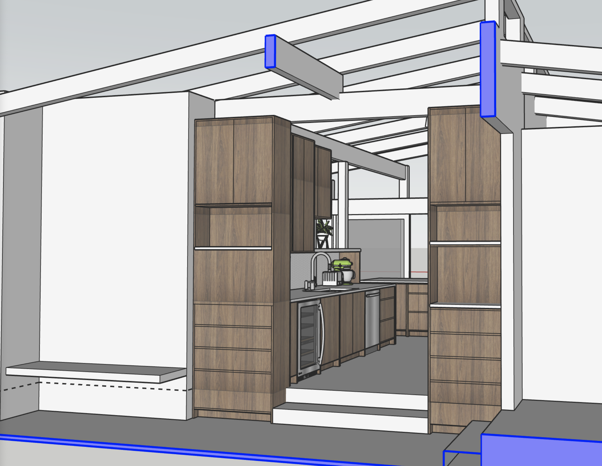
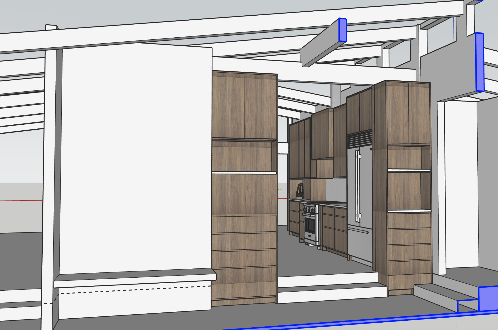
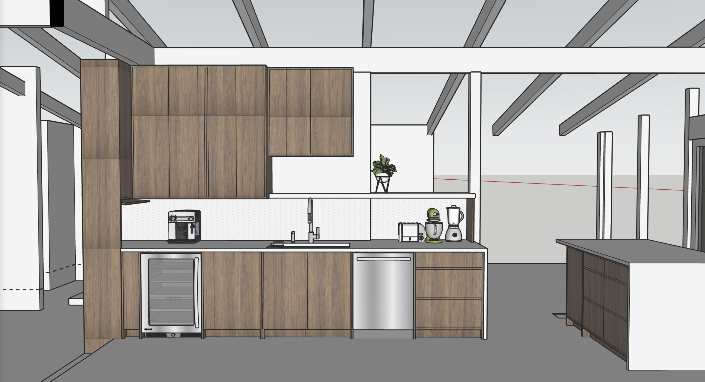

Table of Contents
=================

* [Kitchen Remodel Overview](#kitchen-remodel-overview)
* [Work Breakdown](#work-breakdown)
* [Project Execution](#project-execution)
   * [Design](#design)
   * [Prework](#prework)
   * [Demo](#demo)
   * [Construction - alterations](#construction---alterations)
   * [Construction - finish](#construction---finish)
* [Material Specifics](#material-specifics)
   * [Appliances](#appliances)
      * [current that will be kept](#current-that-will-be-kept)
      * [new](#new)
   * [Flooring](#flooring)
   * [Surfaces](#surfaces)
   * [Plumbing Fixtures](#plumbing-fixtures)
   * [Electrical](#electrical)
* [Extra Construction Items to Consider / bid](#extra-construction-items-to-consider--bid)
* [Bifold door to deck](#bifold-door-to-deck)
* [Conceptual Images](#conceptual-images)
   * [Looking East](#looking-east)
   * [Looking North](#looking-north)
   * [looking South](#looking-south)

# Kitchen Remodel Overview

  
Expand the overview...

## Scope
As the homeowers we want to reorient and refresh the kitchen to achieve:
* improved flow within the house
* increased work area in the kitchen
* more effective pantry storage
* and better utilization of dead space between the kitchen and deck

## Goals
* Renovate at an appropriate value level for the property (avoid over-improving)
* Perpetuate the mid-century vibe of the house

## Requirements
* larger fridge + more freezer space
* larger sink
* hood vented outside
* microwave
* coffee area (espresso machine + grinder)
* operable skylights to vent heat in summwr months 

## Nice To Have
* Island
* View from the kitchen
* larger doors to deck (bridge outside / inside)

# Work Breakdown
| Work Step | Executed By | Planned Start |
| --- | --- | --- |
| Kitchen Empty | M&M | Week 0 |
| Wall Demo | M&M | Week 1 |
| Cabinet, countertop demo | M&M | Week 1 |
| Floor Demo | M&M | Week 1 |
| Setup Temp Kitchen | M&M | Week 0-1 |
| reframe for new layout | SMB | Week 1-2 |

# Project Execution
## Design
Permit and approved plan set are available on site, see sketchups below for conceptual plans.

## Prework
* ~Clear current kitchen area and cabinets of "stuff"~
  - ~setup temporary means of making food~
* ~Ramboard over any flooring that needs protected~ flooring will be replaced.
* ~Isolate demo area with plastic sheeting leading to deck~
* ~centrally locate appliances to be kept to enable demo/electrical/plumbing/framing/flooring~
* ~order dumpster for placement in driveway~

## Demo
* Disconnect plumbing / electrical
* ~Remove existing countertops + cabinets Fixtures~
* ~Remove drywall to expose work area for electrical and plumbing needs~
* Remove finished floor (vinyl + parquet wood) to subfloor in defined area
* ~Remove drywall + panelling on shared kitchen / dining wall~
* ~Remove drywall between kitchen and living room wall~

## Construction - alterations
* ~raise header between kitchen / dining~
* reframe for opening between kitchen / living with post at East end
* Electrical
  - pull new circuits from panel
    - fridge
    - hood
    - outlets (probably 2 circuits)
    - lights
  - extend 240v range plug to other side of ktichen
    * probably need new 8/3 cable from box since current likely 8/2
  - Inspection point with DCI
* Plumbing
  - ~New Sink supply lines to sink location (prefer PEX-a)~
  - ~new drain path to sink location~
  - ~new vent from sink location up through roof (only copper DWV above roofline)~ - Sub AAV
  - new supply lines for behind fridge and pot filler (existing stub in S wall)
  - Inspection point with DCI
* Install 2-3 velux solar roof windows VSS or similar
  - Coutout roof at install locations
  - construct site-built curb to meet required slope for VSS
    - weld PVC up curb sides
  - install counter flashing and roof window
  - ref: [velux](https://www.veluxusa.com/products/skylights/solar-powered)
 
## Construction - finish
* Drywall / tape / mud as needed to close walls
* Prime + Paint new drywall
* Install + sand + finish new flooring (is this the right order?)
* Install lower/upper cabinets + appliances
  - extend central-vacuum line to kickplate of cabinet
* Install island cabinets
* Fabricate & Install Countertops + backslpashes
* Install plumbing fixtures
* fill recepticle / switch boxes / plugmolds
  
# Material Specifics
## Appliances
### current that will be kept
* [Cafe range](https://www.cafeappliances.com/appliance/Cafe-30-Smart-Slide-In-Front-Control-Induction-and-Convection-Double-Oven-Range-CHS950P2MS1)
* [Bosch Dishwasher](https://www.bosch-home.com/us/productslist/home-appliances/SHP865ZP5N)
* [Rocket espresso machine](https://www.rocket-espressousa.com/giotto-timer-evo-r-espresso-machine)
* [Niche coffee grinder](https://www.nichecoffee.co.uk/products/niche-zero)
### new
* 42" built-in fridge *Ordered:* [Dacor 42"](https://image-us.samsung.com/SamsungUS/dacor/products/refrigeration/side-by-side-refrigeration/drs425300sr/download/Dacor42Side-By-SideRefrigeratorSpecSheet-DRS425300SR_DA_w-Disclaimer.pdf)
* microwave drawer *Ordered:* [Zephyr 24"](http://docs.zephyronline.com/docs/specs/MWDxx01AS_spec.pdf)
* Range Hood - *Ordered:* [Faber Inca in-light 35"](https://www.faberonline.com/wp-content/uploads/2018/04/Inca-In-Light_Insert_2022-Spec_Rev4-1022.pdf)

## Flooring
* [Prima Floors Regency Collection European White Oak Engineered flooring](https://www.primafloors.com/pdt_1/id-32.html)
  * Nail down
  * Color: GW339/New Castle
  * 7.48" wide
  * 
  * 

## Surfaces
* Countertop TBD - choices include:
  * paperstone
  * quartz
  * possibly for island: [wood block](http://www.crosscuthardwoods.com/walnut-countertops.html)
* Backsplash TBD
  * Tile
  * Solid Panel?
* Inserts
  * Knockbox Chute: https://rattleware.com/product/25102/
  * Compost Chute behind sink

## Plumbing Fixtures
* [Kohler Prolific Sink](https://www.kohler.com/en/products/kitchen-sinks/shop-kitchen-sinks/prolific-33-undermount-single-bowl-workstation-kitchen-sink-5540?skuId=5540-NA)
* Faucet current American Standard motion faucet
* Pot Filler (tbd) likely Moen

## Electrical
* white Legrand spec grade backwire outlets

# Extra Construction Items to Consider / bid

# Bifold door to deck
It's not clear if this is in the budget. It would be a nice addition. Expected work:
* Remove current door/windows to ~120in wide opening
* build new header across opening
* replace and frame in new upper glass units
* install new bifold door
* Have upper glass film'd (to match current film on other upper windows)

# Conceptual Images
These views are from sketchup diagrams built from CADs (AutoCad LT DWG)

## Looking East

## Looking North

## looking South

