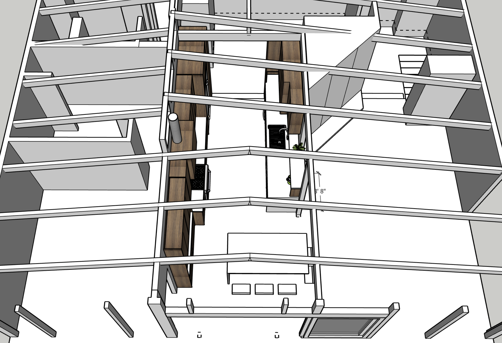

# Kitchen Remodel Scope Statement
As the homeowers we want to reorient and refresh the kitchen to achieve:
* improved flow within the house
* increased work area in the kitchen
* more effective pantry storage
* and better utilization of dead space between the kitchen and deck

# Goals
* Renovate at an appropriate value level for the property (avoid over-improving)
* Perpetuate the mid-century vibe of the house

# Requirements
* larger fridge + more freezer space
* larger sink
* hood vented outside
* microwave
* coffee area (espresso machine + grinder)

## Nice To Have
* Island
* View from the kitchen
* larger doors to deck (bridge outside / inside)

# Project Execution
## Design
See DWG files

## Prework
* Clear current kitchen area and cabinets of "stuff"
  - setup temporary means of making food
* Ramboard over any flooring that needs protected
* Isolate demo area with plastic sheeting
* relocate and remove appliances to be kept
* order dumpster for placement in driveway

## Demo
* Disconnect plumbing / electrical
* Remove existing countertops + cabinets Fixtures
* Remove drywall to expose work area for electrical and plumbing needs
* Remove finished floor (vinyl + parquet wood) to subfloor in defined area
  - this is up for negotiation but I expect the main floor and entry flooring to be replaced
* Remove drywall + panelling on shared kitchen / dining wall
* Remove drywall between kitchen and living room wall

## Construction - alterations
* raise header between kitchen / dining
* reframe for opening between kitchen / living with post at East end
* Electrical
  - pull new circuits from panel
    - fridge
    - hood
    - outlets (probably 2 circuits)
    - lights
  - Inspection point with DCI
* Plumbing
  - New supply lines to sink location
  - new drain path to sink location
  - new vent from sink location up through roof
  - new supply lines for behind fridge and pot filler
  - Inspection point with DCI
* Install 2-3 velux solar roof windows VSS or similar
  - Coutout roof at install locations
  - construct site-built curb if required at specified slope
    - weld PVC up curb sides
  - install counter flashing and roof window
  - ref: https://www.veluxusa.com/products/skylights/solar-powered
 
## Construction - finish
* Drywall / tape / mud as needed to close walls
* Prime + Paint new drywall
* Install + sand + finish new flooring (is this the right order?)
* Install floor/wall cabinets + appliances
* Install island cabinets
* Fabricate & Install Countertops + backslpashes
* Install plumbing fixtures
* fill recepticle / switch boxes
  
# Material Details
## Appliances
### current that will be kept
* Cafe range (https://www.cafeappliances.com/appliance/Cafe-30-Smart-Slide-In-Front-Control-Induction-and-Convection-Double-Oven-Range-CHS950P2MS1)
* Bosch Dishwasher (https://www.bosch-home.com/us/productslist/home-appliances/SHP865ZP5N)
* Rocket espresso machine (https://www.rocket-espressousa.com/giotto-timer-evo-r-espresso-machine)
* Niche coffee grinder (https://www.nichecoffee.co.uk/products/niche-zero)
### new
* 42" built-in fridge (https://www.cafeappliances.com/appliance/Cafe-42-Smart-Built-In-Side-by-Side-Refrigerator-with-Dispenser-CSB42YP2NS1)
* microwave drawer (https://www.albertlee.biz/product/sharp-12-cu-ft-stainless-steel-microwave-drawer-smd2470asy-440554)
* Range Hood - TBD

## Flooring
* Common #1 white oak (https://www.emersonhardwood.com/unfinishedflooring)
  * Osmo Polyx Oil finish (or similar)
  * E-W orientation on main floor, N-S orientation on entry level

## Surfaces
* Countertop TBD - choices include:
  * paperstone
  * quartz
  * wood block (http://www.crosscuthardwoods.com/walnut-countertops.html)
* Backsplash TBD
  * Tile
  * Solid Panel?
* Inserts
  * Knockbox Chute: https://rattleware.com/product/25102/
  * Compost Chute

## Plumbing Fixtures
* Kohler Prolific Sink (https://www.kohler.com/en/products/kitchen-sinks/shop-kitchen-sinks/prolific-33-undermount-single-bowl-workstation-kitchen-sink-5540?skuId=5540-NA)
* Faucet (tbd)
* Pot Filler (tbd)

## Electrical
* TBD

# Extra Construction Items to Consider / bid

# Bifold door to deck
It's not clear if this is in the budget. It would be a very nice addition. Expected work:
* Remove current door/windows to ~120in wide opening
* build new header across opening
* replace and frame in new upper glass units
* install new bifold door
* Have upper glass film'd (to match current film on other upper windows)

# Conceptual Images
These views are from sketchup diagrams built from CADs (AutoCad LT DWG)

## Overview

